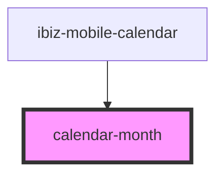

# calendar-month

<!-- Auto Generated Below -->

## Properties

| Property        | Attribute         | Description | Type            | Default          |
| --------------- | ----------------- | ----------- | --------------- | ---------------- |
| `_id`           | `_id`             |             | `any`           | `undefined`      |
| `color`         | `color`           |             | `string`        | `defaults.COLOR` |
| `isSaveHistory` | `is-save-history` |             | `boolean`       | `undefined`      |
| `month`         | --                |             | `CalendarMonth` | `undefined`      |
| `pickMode`      | `pick-mode`       |             | `string`        | `undefined`      |
| `readonly`      | `readonly`        |             | `boolean`       | `false`          |

## Events

| Event         | Description | Type                         |
| ------------- | ----------- | ---------------------------- |
| `change`      |             | `CustomEvent<CalendarDay[]>` |
| `select`      |             | `CustomEvent<CalendarDay>`   |
| `selectEnd`   |             | `CustomEvent<CalendarDay>`   |
| `selectStart` |             | `CustomEvent<CalendarDay>`   |

## Dependencies

### Used by

 - [ibiz-mobile-calendar](..)

### Graph

----------------------------------------------

*Built with [StencilJS](https://stenciljs.com/)*
