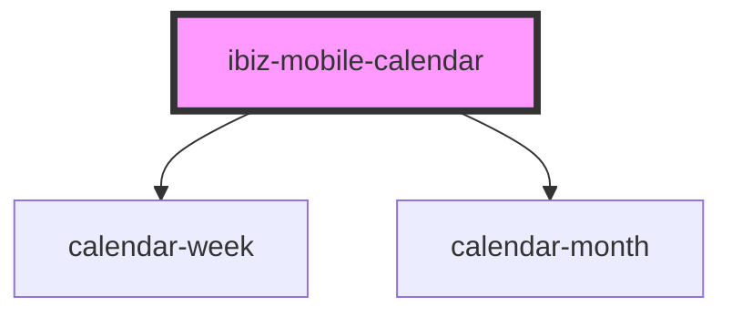

# ibiz-mobile-calendar

<!-- Auto Generated Below -->

## Properties

| Property   | Attribute  | Description | Type                                                      | Default                |
| ---------- | ---------- | ----------- | --------------------------------------------------------- | ---------------------- |
| `format`   | `format`   |             | `string`                                                  | `defaults.DATE_FORMAT` |
| `options`  | --         |             | `CalendarComponentOptions`                                | `undefined`            |
| `readonly` | `readonly` |             | `boolean`                                                 | `false`                |
| `type`     | `type`     |             | `"js-date" \| "moment" \| "object" \| "string" \| "time"` | `'string'`             |

## Events

| Event         | Description | Type                                          |
| ------------- | ----------- | --------------------------------------------- |
| `change`      |             | `CustomEvent<Date \| number \| string \| {}>` |
| `monthChange` |             | `CustomEvent<CalendarComponentMonthChange>`   |
| `select`      |             | `CustomEvent<CalendarDay>`                    |
| `selectEnd`   |             | `CustomEvent<CalendarDay>`                    |
| `selectStart` |             | `CustomEvent<CalendarDay>`                    |

## Dependencies

### Depends on

- [calendar-week](calendar-week)
- [calendar-month](calendar-month)

### Graph

----------------------------------------------

*Built with [StencilJS](https://stenciljs.com/)*
